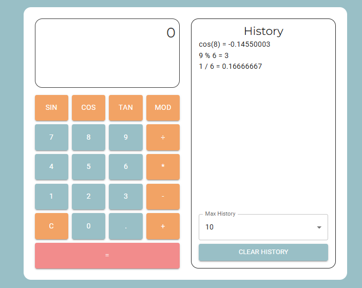

# Simple Calculator App

[Calculator](https://niisku.lab.fi/~tyynekaisa/calculator/)

This is an exercise for Browser Platform (Selainalusta) course.
Currently, the calculator can perform simple calculations with only one or two numbers.

History uses localStorage and remains between browser sessions.

